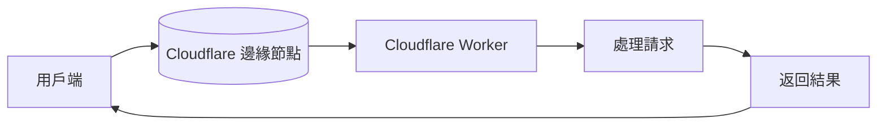

最近，我在使用 Cloudflare Worker 架設 Telegram Bot 時，發現其作為免費後端服務相比 Vercel 仍然具有顯著的優勢。

<!-- more -->

------

## 主要優勢

- 優異的免費方案
    - 每天提供高達 10 萬次的 API 呼叫次數
    - 內建類似 LocalStorage 的 KV（鍵值儲存）功能
- 卓越的性能表現
    - 採用 V8 引擎
    - 極快的啟動速度
    - 優異的函式執行效率
- 實用場景
    - 快速建立測試用的 Mock 後端
    - 作為 Proxy 解決跨域（CORS）問題
    - 輕量級的 API 服務

雖然在撰寫程式時沒有 Node.js 那麼直覺，也不支援一些瀏覽器原生 API，但我個人認為這款 FaaS（Function as a Service）服務應該成為前端開發人員必學的技能之一。撰寫採用JS語言，對於前端開發者來說非常容易上手。

------

## 部署教學


1. 到[Cloudflare Dashboard](https://dash.cloudflare.com/)  註冊後可以直接拉到 Workers 和 Pages 頁面

   

2. 點選建立後選擇建立 Worker


3. 隨意取個名稱，按「部署」就會建立簡單的專案


4. 部署後點「編輯代碼」，就可以開始撰寫程式


## Cloudflare Worker 開發

Faas 的原理其實就是將程式碼部署到雲端，然後透過 API 呼叫來執行。

在**處理請求**的階段透過 export 的 function 來建立 API 端點，用戶端如果是透過 HTTP 請求，就會呼叫到 export 的 `fetch` function。




### 範例

Fetch 的 Request 屬性


```js
// 處理請求(request 請求, env 環境變數, ctx 上下文)
export default {
  async fetch(request, env, ctx) { 
    const url = new URL(request.url);
    if(request.method === 'OPTIONS') {         // 處理跨域請求
      return new Response(null, {status: 200}); // 返回結果
    }
    if(request.method === 'GET') { // Client 使用 GET 呼叫觸發的程式
     if(url.pathname === '/'){
        const fakeHTML = `<html><body><h1>Hello World</h1></body></html>`
        return new Response(fakeHTML, {headers: {'Content-Type': 'text/html;charset=utf-8'}});// 返回結果
     }else{
      return new Response('這裡不是你應該來的地方', {status: 404}); // 返回結果
     }
    }
    
  },
};
```

貼上後即可在右側即時編譯看到結果


點擊「部署」後，即可看在對應連結看到部署的結果

如果要針對特定 API 進行測試，可以到「HTTP」頁面，用測試的方法和輸入資料做簡單測試


 
### Fetch 的 Request 屬性

以下列出 Fetch 常用的的 Request 屬性。( 更多屬性請參考 [fetch Request](https://developer.mozilla.org/en-US/docs/Web/API/Request) )

 屬性 | 設定值 |
|------|---------|
| url | 第一個參數，一定要填的項目，代表需要 fetch 對象的網址 |
| method | GET、POST、PUT、DELETE、HEAD (預設 GET) |
| headers | 要求相關的 Headers 物件 (預設 {}) |
| mode | cors、no-cors、same-origin、navigate (預設 cors) |
| referrer | no-referrer、client 或某個網址 (預設 client) |
| credentials | omit、same-origin、include (預設 omit) |
| redirect | follow、error、manual (預設 manual) |
| cache | default、no-store、reload、no-cache、force-cache (預設 default) |
| body | 要加到要求中的內容 (如果 method 為 GET 或 HEAD 則不設定) |

<!--  -->


### Fetch 的 Response 屬性

以下列出 Fetch 常用的 Response 屬性。( 更多屬性和方法請參考 [fetch Response](https://developer.mozilla.org/en-US/docs/Web/API/Response) )

| 屬性 | 設定值 |
|------|---------|
| headers | 包含與 response 相關的 Headers 物件 |
| ok | 成功回傳 true，不成功回傳 false |
| status | 狀態代碼，成功為 200 |
| statusText | 狀態文字，成功為 ok |
| type | response 的類型，例如 basic、cors...等 |
| url | response 的 url |

<!--  -->


更多基本用法可以參考 [Fetch API 基本教學](https://www.oxxostudio.tw/articles/201908/js-fetch.html)


### 處理POST

如果要發送 POST 請求，一定要加上 `OPTIONS` 屬性，否則會報 CORS 錯誤。

#### 簡單請求 (Simple Request)

瀏覽器的簡單請求不需要預檢請求(OPTIONS)，需要符合以下條件:

1. 請求方法必須是以下其中之一:
   - GET
   - HEAD  
   - POST
2. 請求標頭Content-Type (只能是以下三種)
   - application/x-www-form-urlencoded
   - multipart/form-data
   - text/plain

假設我在前端發送了一個 JSON 格式的資料，我帶上 `Content-Type: application/json` 的標頭，而沒有加上`OPTIONS`回應這樣就會觸發瀏覽器CORS而報錯。

```js
await fetch(`${updataAPI}/setDataToKV`, {
  method: 'POST',
  body: JSON.stringify({
    time: Date.now(),
    data: JSON.parse(jsonData)
  })
});
```

所以我在後端一定要配置好`OPTIONS` 屬性，否則會報 CORS 錯誤。

下面是一個簡單的範例，包含 CORS 處理和 POST 請求的處理。

```js
export default {
  async fetch(request, env, ctx) {
    // 定義 CORS 標頭
    const corsHeaders = {
      'Access-Control-Allow-Origin': '*',
      'Access-Control-Allow-Methods': '*',
      'Access-Control-Allow-Headers': 'Content-Type',
      'Content-Type': 'text/html;charset=utf-8',
    };

    const JSONcorsHeaders = {
      ...corsHeaders,
      'Content-Type': 'application/json;charset=utf-8',
    };

    const url = new URL(request.url);

    // 處理 CORS 預檢請求
    if (request.method === 'OPTIONS') {
      return new Response('', { headers: corsHeaders });
    }

    // 處理 GET 請求
    if (request.method === 'GET') {
      return new Response('這裡不是你應該來的地方', { 
        status: 404, 
        headers: corsHeaders 
      });
    }

    // 處理 POST 請求
    if (request.method === 'POST') {
      if (url.pathname === '/setDataToKV') {
        try {
          const data = await request.json();

          await env.pcbuydata.put(
            `pcbuydata-${data.time}`, 
            JSON.stringify(data.data)
          ); //這邊呼叫了Cloudflare Worker 的專屬 API KV 來儲存資料

          return new Response('完整資料已成功儲存到 KV 中', { 
            status: 200, 
            headers: corsHeaders 
          });

        } catch (err) {
          return new Response(`資料儲存失敗：${err}`, { 
            status: 500, 
            headers: corsHeaders 
          });
        }
      }
    }

    // 處理不支援的請求
    return new Response("方法不允許", { 
      status: 405, 
      headers: corsHeaders 
    });
  }
};

```


這邊有一個簡單的 Worker Proxy 範例，可以參考。

只要部署後在訪問 

`https://<你的worker名稱>/?url=https://www.dgpa.gov.tw/typh/daily/nds.html` 

就可以看到結果。

如果網站安全性做的好一點，其實會被封鎖，但政府網站就...懂的都懂

```js
export default {
    async fetch(request, env, ctx) {
        const corsHeaders = {
            'Access-Control-Allow-Origin': '*',
            'Access-Control-Allow-Methods': 'GET',
            'Content-Type': 'text/html;charset=utf-8',
        }

        if (request.method === 'OPTIONS') {
            return new Response(null, { headers: corsHeaders })
        }

        try {
            const url = new URL(request.url);
            const targetUrl = url.searchParams.get('url');

            if (!targetUrl) {
                return new Response('缺少 url 參數', {
                    status: 400,
                    headers: corsHeaders
                });
            }

            // 添加更多的 headers 模擬真實瀏覽器
            const response = await fetch(targetUrl, {
                headers: {
                    'User-Agent': 'Mozilla/5.0 (Windows NT 10.0; Win64; x64) AppleWebKit/537.36 (KHTML, like Gecko) Chrome/120.0.0.0 Safari/537.36',
                    'Accept': 'text/html,application/xhtml+xml,application/xml;q=0.9,image/webp,image/apng,*/*;q=0.8',
                    'Accept-Language': 'zh-TW,zh;q=0.9,en-US;q=0.8,en;q=0.7',
                    'Accept-Encoding': 'gzip, deflate, br',
                    'Connection': 'keep-alive',
                    'Upgrade-Insecure-Requests': '1',
                    'Sec-Fetch-Dest': 'document',
                    'Sec-Fetch-Mode': 'navigate',
                    'Sec-Fetch-Site': 'none',
                    'Sec-Fetch-User': '?1'
                },
                redirect: 'follow'
            });

            // 檢查回應狀態
            if (!response.ok) {
                throw new Error(`HTTP error! status: ${response.status}`);
            }

            const newResponse = new Response(response.body, {
                status: response.status,
                headers: {
                    ...Object.fromEntries(response.headers),
                    ...corsHeaders,
                    'Cache-Control': 'no-store, no-cache, must-revalidate'
                }
            });

            return newResponse;
        } catch (error) {
            return new Response(JSON.stringify({ 
                error: error.message,
                details: '可能是目標網站的安全限制或 IP 被封鎖'
            }), {
                status: 500,
                headers: {
                    ...corsHeaders,
                    'Content-Type': 'application/json'
                }
            });
        }
    }
}

```